<!-- hero: monochrome ASCII portrait (types in) beside the info card
     widths are picked so both panels land at the same height. -->

<h3><code>amit@github ~ $ whoami</code></h3>

<table>
<tr>
<td valign="top"></td>
<td valign="top"></td>
</tr>
</table>

 
 

<!-- animated contribution graph: real data, boxes reveal cell by cell
     (regenerated daily by .github/workflows/update-profile-art.yml) -->

<h3><code>amit@github ~ $ ./contributions.sh</code></h3>

 
 

